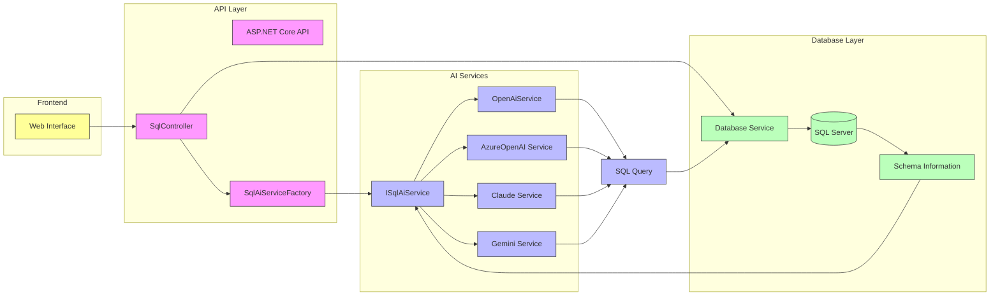
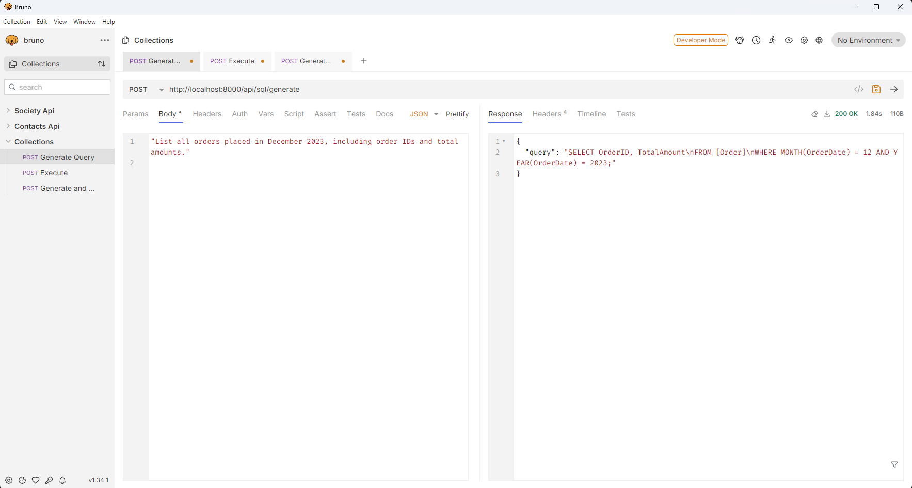
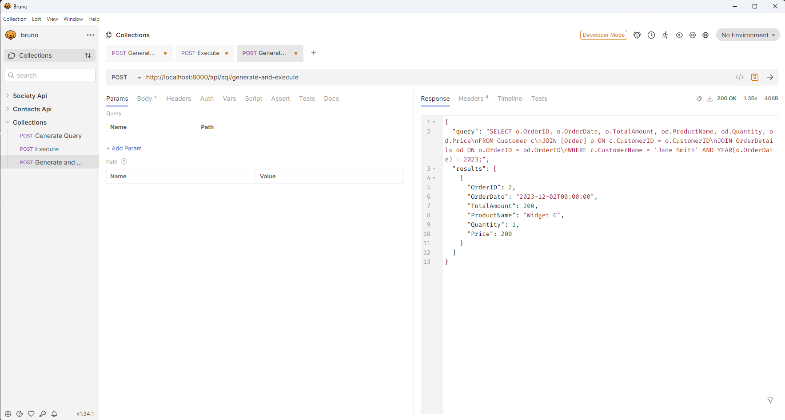

# SQL Query AI Builder


## TL;DR

SQL Query AI Builder is a multi-provider AI platform that transforms natural language into SQL queries. It supports multiple LLM providers (OpenAI, Azure OpenAI, Anthropic's Claude, and Google's Gemini), allowing you to easily switch between them using configuration settings. The application includes a .NET 9 backend API that generates and executes SQL against a demo database, all containerized with Docker for easy setup.

Key features include:
- Dynamic provider selection using environment variables or appsettings.json
- Consistent prompt formatting across all AI providers
- Robust SQL Server container configuration with separated database initialization
- Factory pattern for AI service implementation
- Schema-aware SQL generation with direct query execution

## Features

- **Multi-Provider LLM Integration:** Supports OpenAI, Azure OpenAI, Claude, and Gemini models
- **Natural Language SQL Query Generation:** Converts user prompts into accurate SQL queries
- **SQL Query Execution:** Executes generated SQL queries against a SQL Server database
- **Schema-Aware Generation:** Uses database schema and relationships for context-aware query creation
- **Docker Support:** Easy deployment with Docker and Docker Compose
- **Factory Pattern Architecture:** Dynamically selects the appropriate AI service based on configuration

## Architecture

The application uses a service factory pattern to dynamically select the appropriate AI service based on configuration settings:



The architecture follows a factory pattern that allows dynamic selection of AI services:

## Prerequisites

- **Without Docker:**
  - .NET 9.0 SDK or later
  - Microsoft SQL Server
  - API keys for your chosen LLM provider(s)

- **With Docker:**
  - Docker Desktop

## Setup

### 1. Clone the Repository

```sh
git clone https://github.com/yourusername/AIQueryBuilder.git
cd AIQueryBuilder
```

### 2. Configure Environment Variables

Create a `.env` file in the root directory based on the provided `.env-example`:

```sh
cp .env-example .env
```

Edit the `.env` file to configure your environment:

```ini
# Environment
ENVIRONMENT=Development

# SQL Server Configuration
SQL_SERVER=mssql
SQL_DATABASE=DemoDB
SQL_USER=sa
SQL_PASSWORD=YourStrong@Passw0rd

# AI Provider Configuration - Choose one: OpenAI, AzureOpenAI, Claude, Gemini
AI_PROVIDER_TYPE=OpenAI

# Provider-specific keys (only need to fill in the one you're using)
# OpenAI Configuration
OPENAI_API_KEY=your-openai-api-key-here
OPENAI_MODEL=gpt-4o

# Azure OpenAI Configuration
AZURE_OPENAI_API_KEY=your-azure-openai-api-key-here
AZURE_OPENAI_ENDPOINT=your-azure-openai-endpoint-here
AZURE_OPENAI_DEPLOYMENT_NAME=your-azure-deployment-name-here
AZURE_OPENAI_MODEL=gpt-4

# Claude Configuration
CLAUDE_API_KEY=your-claude-api-key-here
CLAUDE_MODEL=claude-3-sonnet-20240229

# Gemini Configuration
GEMINI_API_KEY=your-gemini-api-key-here
GEMINI_MODEL=gemini-pro
```

### 3. Running with Docker

1. **Build and start the containers:**

```sh
docker-compose up --build
```

2. **Access the application:**
   - The API will be available at `http://localhost:8000`
   - The database will be initialized automatically via the separate db-init service

3. **In case of database initialization issues:**
   If you encounter issues with database initialization (which can happen with SQL Server containers), you can manually seed the database:

```sh
docker exec -it sqlserver_express /opt/mssql-tools/bin/sqlcmd -S localhost -U sa -P YourStrong@Passw0rd -d master -i /scripts/seed-data.sql
```

Replace `YourStrong@Passw0rd` with the password you set in your `.env` file.

### 4. Running Without Docker

1. **Set up your SQL Server:**
   - Create a database named `DemoDB`
   - Run the `scripts/seed-data.sql` script to create tables and seed data

2. **Configure application settings:**
   - Update `api/appsettings.Development.json` with your database connection string and LLM provider details

3. **Build and run the application:**

```sh
cd api
dotnet build
dotnet run
```

4. The API will be available at `http://localhost:5275`

## Using the API

### 1. Generate SQL Query

Send a POST request to generate SQL from natural language:

```http
POST http://localhost:8000/api/sql/generate
Content-Type: application/json

"List all orders with order details, customer name placed in December 2023, including order IDs and total amounts."
```



### 2. Execute SQL Query

Send a POST request to execute a SQL query:

```http
POST http://localhost:8000/api/sql/execute
Content-Type: application/json

"SELECT o.OrderID, c.CustomerName, o.OrderDate, o.TotalAmount, od.ProductName, od.Quantity, od.Price 
FROM [Order] o
JOIN OrderDetails od ON o.OrderID = od.OrderID
JOIN Customer c ON o.CustomerID = c.CustomerID
WHERE o.OrderDate >= '2023-12-01' AND o.OrderDate < '2024-01-01';"
```

### 3. Generate and Execute in One Step

Send a POST request to generate SQL from natural language and execute it immediately:

```http
POST http://localhost:8000/api/sql/generate-and-execute
Content-Type: application/json

"List all orders with order details, customer name placed in December 2023, including order IDs and total amounts."
```



## Switching AI Providers

You can switch between AI providers by changing the `AI_PROVIDER_TYPE` in your `.env` file or by setting the corresponding environment variable. Available options:

- `OpenAI` - Uses OpenAI's models (default: gpt-4o)
- `AzureOpenAI` - Uses Azure OpenAI deployment
- `Claude` - Uses Anthropic's Claude model
- `Gemini` - Uses Google's Gemini model

Make sure to provide the corresponding API keys and configuration for your chosen provider.

### Provider Configuration Details

#### OpenAI
```ini
AI_PROVIDER_TYPE=OpenAI
OPENAI_API_KEY=your-openai-api-key-here
OPENAI_MODEL=gpt-4o  # You can also use: gpt-4, gpt-3.5-turbo, etc.
```

#### Azure OpenAI
```ini
AI_PROVIDER_TYPE=AzureOpenAI
AZURE_OPENAI_API_KEY=your-azure-openai-api-key-here
AZURE_OPENAI_ENDPOINT=https://your-resource-name.openai.azure.com/
AZURE_OPENAI_DEPLOYMENT_NAME=your-deployment-name-here
AZURE_OPENAI_MODEL=gpt-4  # The underlying model used in your Azure deployment
```

#### Claude (Anthropic)
```ini
AI_PROVIDER_TYPE=Claude
CLAUDE_API_KEY=your-claude-api-key-here
CLAUDE_MODEL=claude-3-sonnet-20240229  # You can also use: claude-3-opus-20240229, claude-3-haiku-20240307
```

#### Gemini (Google)
```ini
AI_PROVIDER_TYPE=Gemini
GEMINI_API_KEY=your-gemini-api-key-here
GEMINI_MODEL=gemini-pro  # You can also use: gemini-pro-vision, gemini-ultra (if available)
```

## Troubleshooting

### Common Issues

1. **SQL Server Container Not Starting:** 
   - Ensure you've set a strong password in your `.env` file meeting SQL Server requirements
   - Check container logs: `docker logs sqlserver_express`
   - Make sure port 1433 is not already in use on your host machine
   - Try increasing the healthcheck timeout in docker-compose.yml if initialization is slow

2. **Database Seeding Issues:**
   - If the db-init service fails, check the logs: `docker logs aiquerybuilder-db-init-1`
   - Wait until SQL Server is fully initialized before manually running the seed script
   - Verify your SQL credentials in the `.env` file match what's used in docker-compose.yml

3. **API Connection Issues:**
   - Ensure environment variables are correctly set in your `.env` file
   - Check that the SQL Server is healthy: `docker ps` should show it as running
   - Verify the connection string in the API's logs: `docker logs aiquerybuilder-api-1`
   - Make sure your firewall allows connections to the SQL Server container

4. **AI Provider Issues:**
   - Verify you've set the correct API keys for your chosen provider in the `.env` file
   - Check that the AI_PROVIDER_TYPE variable matches the provider whose API key you've configured
   - Review the API logs for error messages from the AI provider

### Database Connection

The connection string is set via environment variables. If you're not using Docker, make sure to update the connection string in `appsettings.Development.json`. The default connection string format is:

```
Server=mssql;Database=DemoDB;User ID=sa;Password=YourStrong@Passw0rd;Trusted_Connection=False;Encrypt=False;
```

## Contributing

Contributions are welcome! Please feel free to submit a Pull Request.

## License

This project is licensed under the MIT License - see the [LICENSE](LICENSE) file for details.

